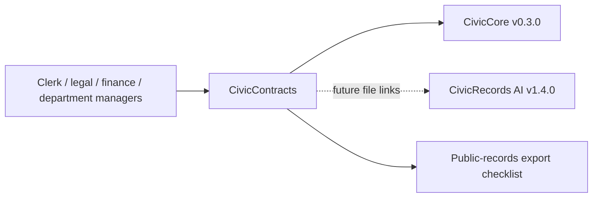

# CivicContracts User Manual

## For Non-Technical Users

CivicContracts helps city staff keep contract records, clause topics, expiration dates, renewal notes, public-records review notes, and export manifests organized. It can create a sample contract registry stub, flag clause topics, build expiration reminders, summarize renewal visibility, and assemble a public-records export checklist.

Current state: `0.1.1` contract repository foundation plus registry persistence release. CivicContracts can optionally save contract registry and renewal visibility records when IT configures `CIVICCONTRACTS_REGISTRY_DB_URL`. CivicContracts does not provide official legal interpretation, legal advice, live contract management platforms, live LLM calls, contract execution workflows, renewal approvals, or contract system-of-record updates. Staff own every decision.

## For IT and Technical Staff

CivicContracts is a FastAPI Python package pinned to `civiccore==0.3.0`. The current runtime exposes:

- `GET /`
- `GET /health`
- `GET /civiccontracts`
- `POST /api/v1/civiccontracts/registry`
- `GET /api/v1/civiccontracts/registry/{contract_id}`
- `POST /api/v1/civiccontracts/clauses/lookup`
- `POST /api/v1/civiccontracts/expirations`
- `POST /api/v1/civiccontracts/renewals/summary`
- `GET /api/v1/civiccontracts/renewals/{contract_id}`
- `POST /api/v1/civiccontracts/export`

Run:

```bash
python -m pip install -e ".[dev]"
python -m pytest -q
bash scripts/verify-release.sh
```

Set `CIVICCONTRACTS_REGISTRY_DB_URL` to enable local SQLAlchemy-backed contract registry and renewal visibility records. If the variable is not set, CivicContracts keeps deterministic stateless behavior and retrieval endpoints return actionable configuration guidance.

## Architecture



CivicContracts depends on CivicCore. CivicCore does not depend on CivicContracts. CivicContracts v0.1.1 uses deterministic sample contract data plus optional local registry persistence; live contract management platforms, CivicRecords file links, staff review queues, and production contract-system integrations are future work.
